# Scenario

In this Challenge Lab, you will establish a location for the exchange of files with external customers, and you will ensure that the documents use version control to protect them from accidental deletion.

First, you will create the files for a static HTML website, and then you will create a new Amazon Simple Storage Service (Amazon S3) bucket.

Next, you will upload the HTML website, and then you will set permissions for public read access.

Finally, you will turn on static hosting for your bucket, and then you will create a second bucket that will securely store log files to ensure that only authorized users are accessing your files.

# Create buckets

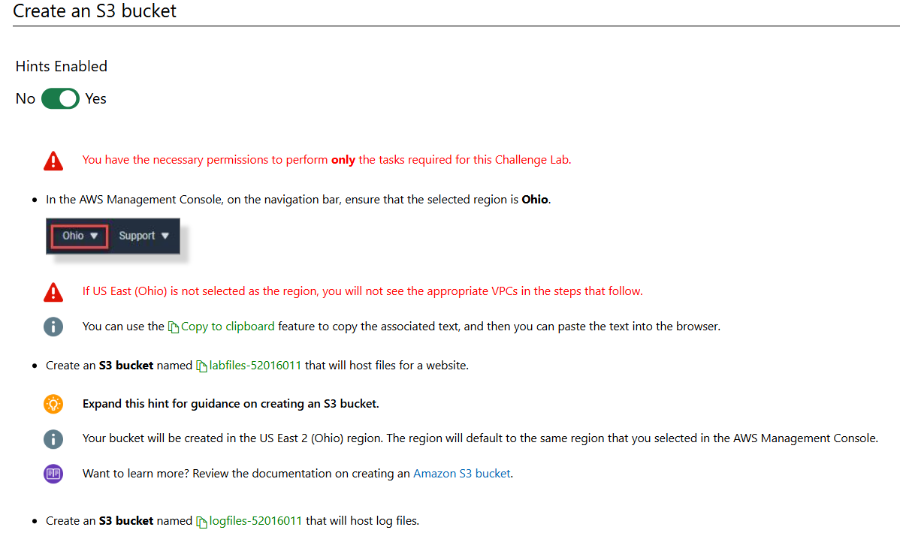

# Configure the properties for the lab files bucket

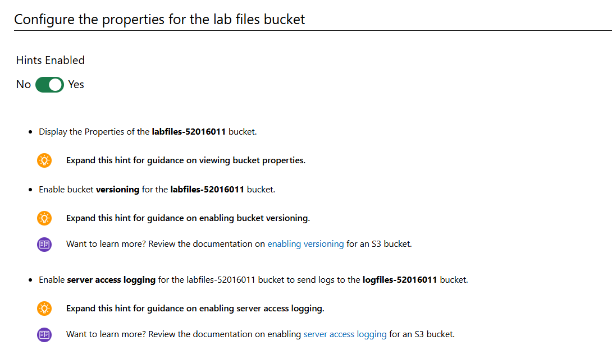

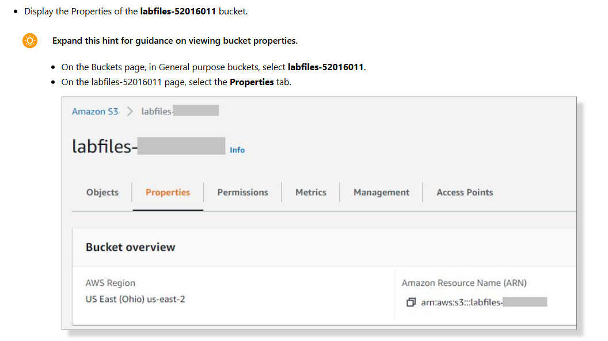

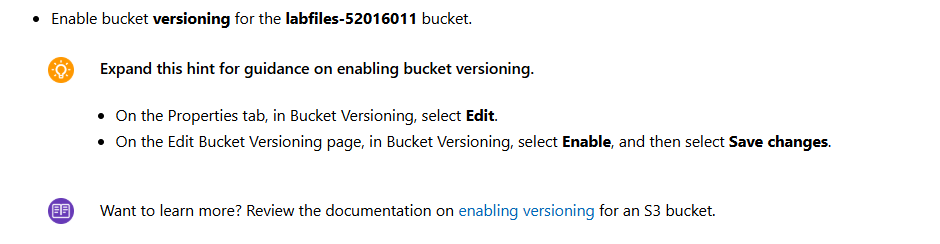

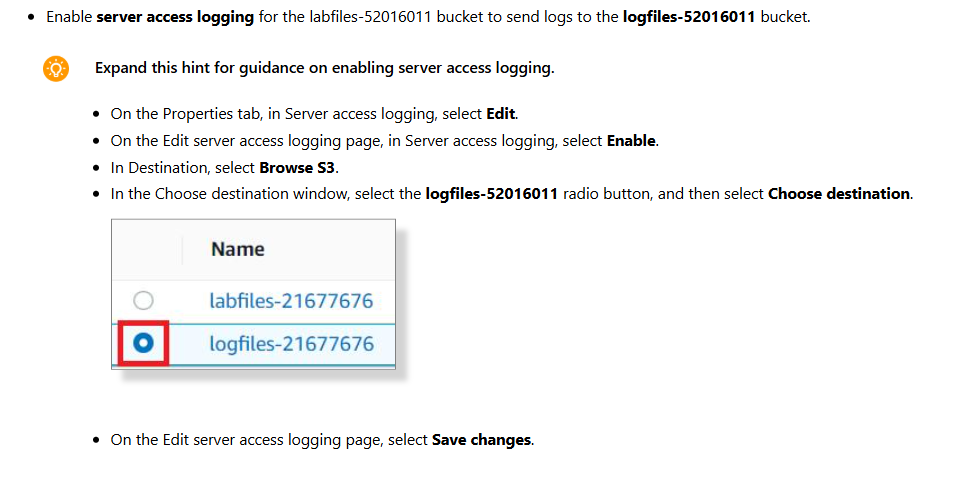

# Display the properties of the log files bucket

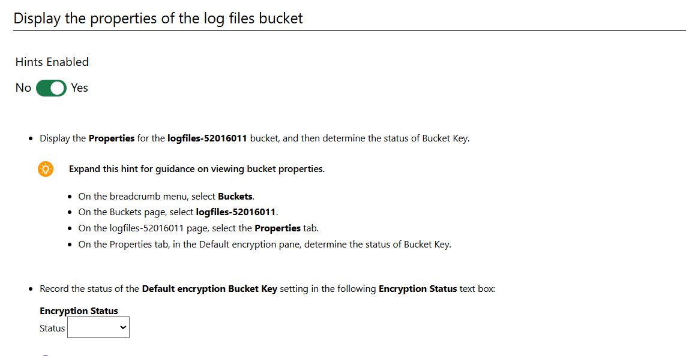

# Create and upload the files for a static website

```
<html lang="en">
<head>
<meta charset="utf-8" />
    <title>Hello World!</title>
    <link rel="stylesheet" href="hw.css">
</head>
<body>
<div class="mainBox">
    <div class="textBox">
        <h1>Hello World!</h1>
    </div>
    
</div>
</body>
</html>
```

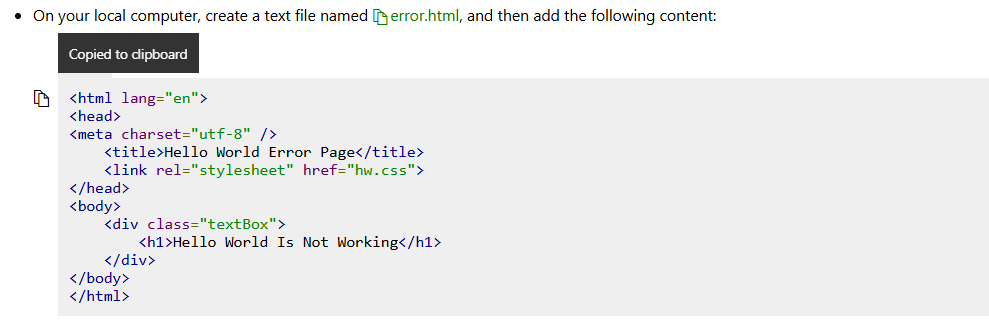

```
<html lang="en">
<head>
<meta charset="utf-8" />
    <title>Hello World Error Page</title>
    <link rel="stylesheet" href="hw.css">
</head>
<body>
    <div class="textBox">
        <h1>Hello World Is Not Working</h1>
    </div>
</body>
</html>
```

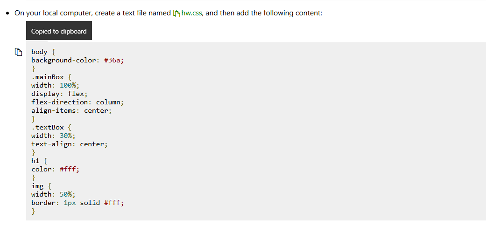

```
body {
background-color: #36a;
}
.mainBox {
width: 100%;
display: flex;
flex-direction: column;
align-items: center;
}
.textBox {
width: 30%;
text-align: center;
}
h1 {
color: #fff;
}
img {
width: 50%;
border: 1px solid #fff;
}
```

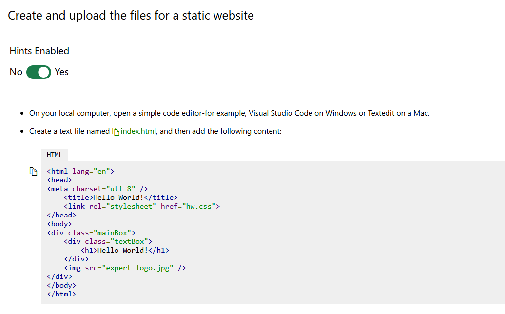

- cho phép log-bucket log vào log-bucket

```
<html lang="en">
<head>
<meta charset="utf-8" />
    <title>Hello World!</title>
    <link rel="stylesheet" href="hw.css">
</head>
<body>
<div class="mainBox">
    <div class="textBox">
        <h1>Hello World!</h1>
    </div>
    
</div>
</body>
</html>
```

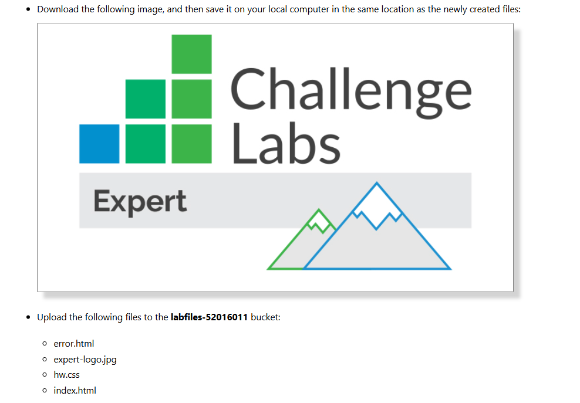

# 3 Config allow access from anywhere to this resource

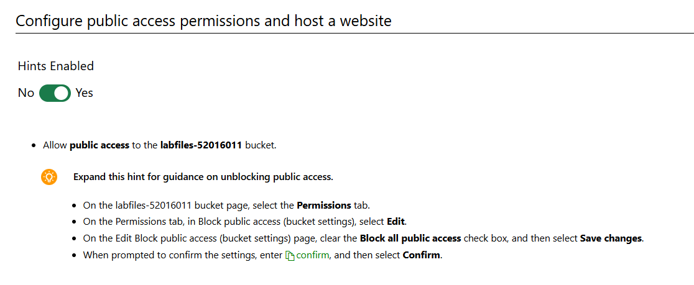

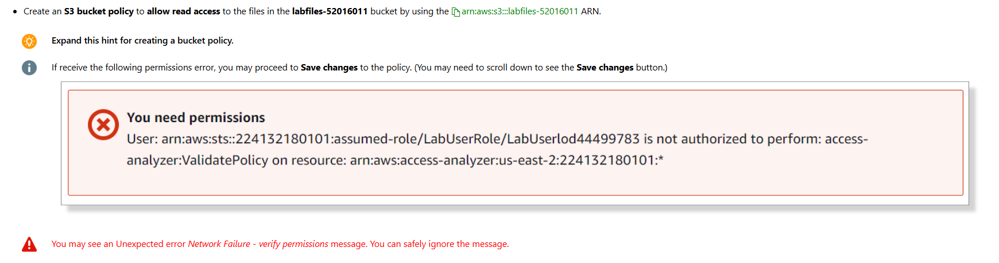

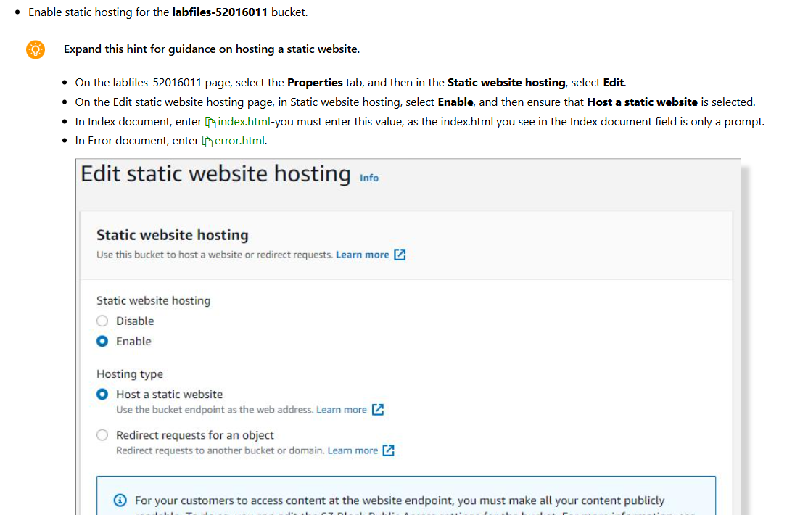

`labfile-52016011` policy

```
{
  "Version": "2012-10-17",
  "Statement": [
    {
      "Sid": "Statement1",
      "Effect": "Allow",
      "Principal": "*",
      "Action": [
        "s3:GetObject"
      ],
      "Resource": "arn:aws:s3:::labfiles-52016011/*"
    }
  ]
}
```

# Summary

Congratulations, you have completed the Configure an S3 Bucket and Website Challenge Lab.

You have accomplished the following:

Created S3 buckets to store content and log files.

Enabled version control.

Enabled server access logging.

Enabled S3 encryption.

Uploaded files to an S3 bucket.

Set public permissions for files.

Enabled public website hosting.
