# Understand the scenario

You are an Amazon Web Services (AWS) Architect at Hexelo. You need to configure an Amazon Simple Storage Service (S3) notification that will send an email when new content is uploaded to an S3 bucket.

First, you will create a new S3 bucket, and then you will create a notification topic.

Next, you will create a policy to allow your S3 bucket to use the notification, and then you then will create an event for your bucket to send a message to the topic.

Finally, you will upload a file, and then you will verify that the notification is working.

# Step by step

## 1. Create S3

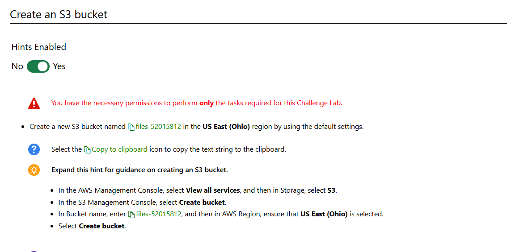

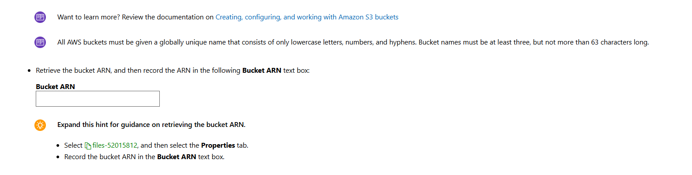

## 2. Create an SNS topic

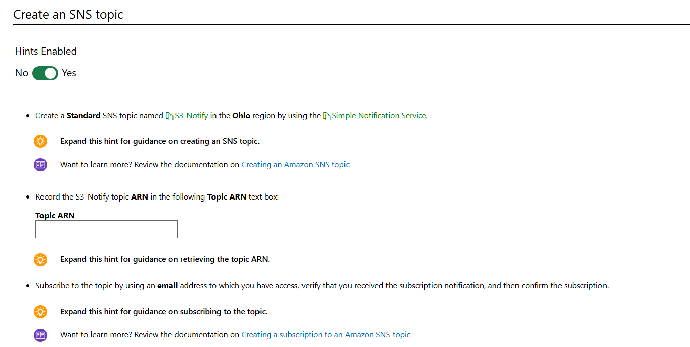

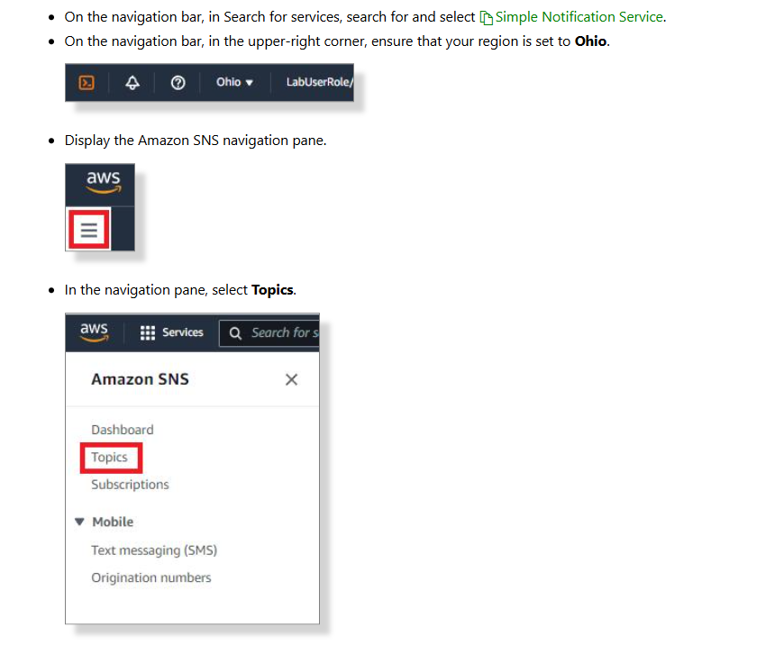

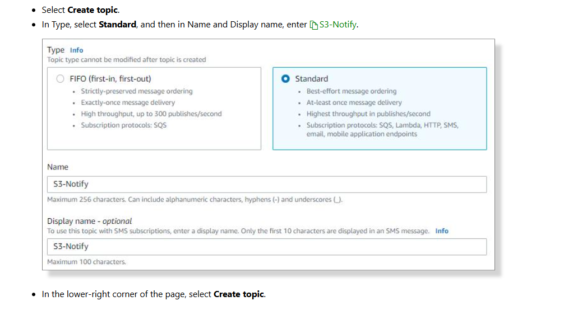

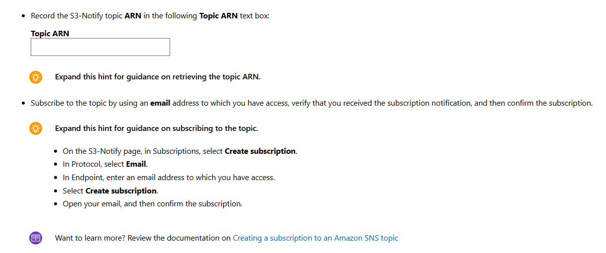

## 3. Configure an access policy for SNS topic

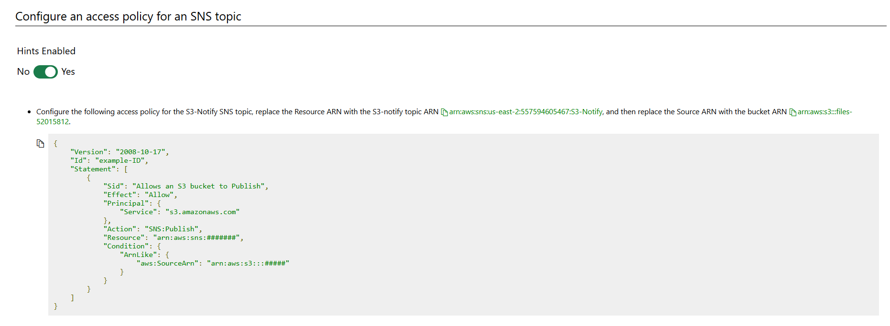

Edit sns policy allow listen every action of s3 event, the publish notification through email

```
{
	"Version": "2008-10-17",
	"Id": "example-ID",
	"Statement": [
		{
			"Sid": "AllowS3ToPublishToSNSTopic",
			"Effect": "Allow",
			"Action": [
                "sns:Publish"
            ],
			"Principal": {
				"Service": "s3.amazonaws.com"
			},
			"Resource": "arn:aws:sns:us-east-2:xxx:S3-Notify",
			"Condition": {
				"ArnLike": {
					"aws:SourceArn": "arn:aws:s3:::files-xxx"
				}
			}

		}
	]
}
```

please change `"Resource": "arn:aws:sns:us-east-2:xxx:S3-Notify",` and `"aws:SourceArn": "arn:aws:s3:::files-xxx"` your self

# Configure an notification event for an s3 bucket

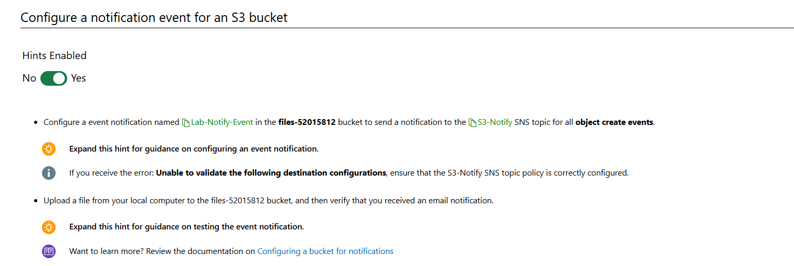

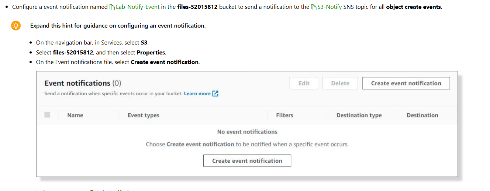

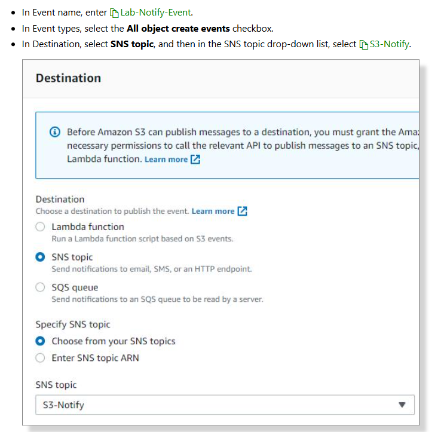

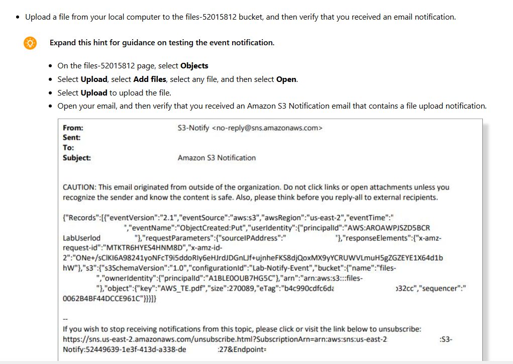

# Summary

- Created a new S3 bucket for file uploads.

- Created a new SNS topic.

- Configured an access policy for an S3 bucket.

- Configured an S3 bucket to send you a notification when new content is uploaded.
