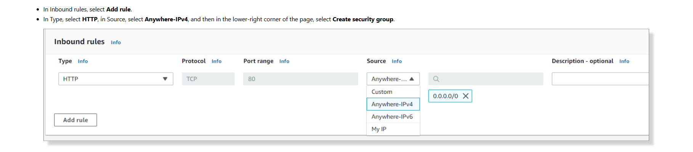
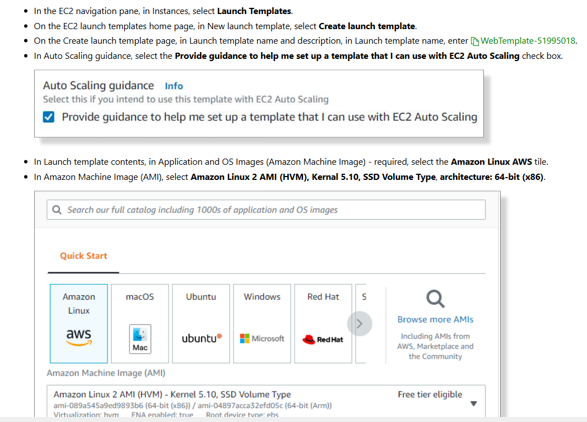
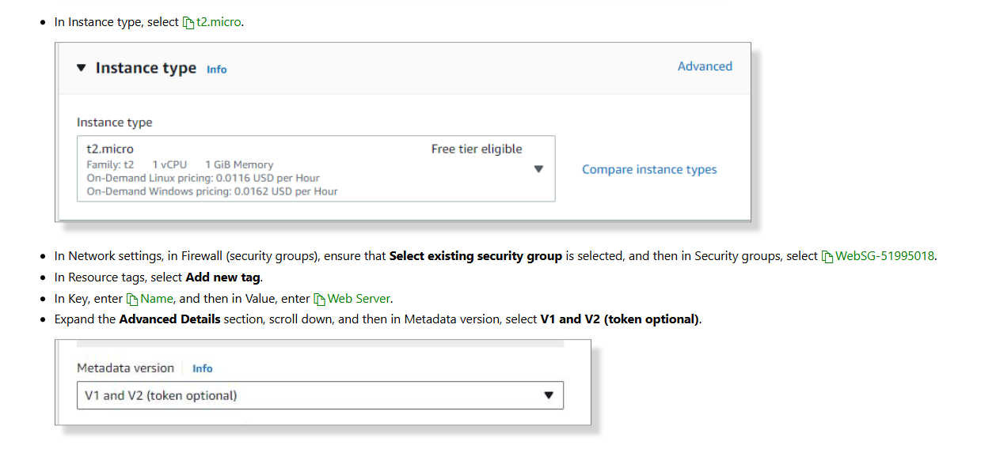
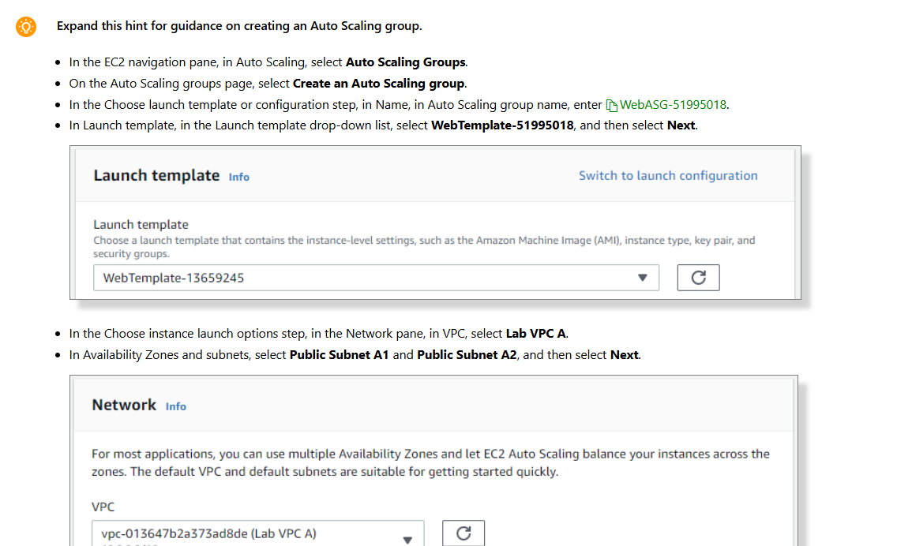
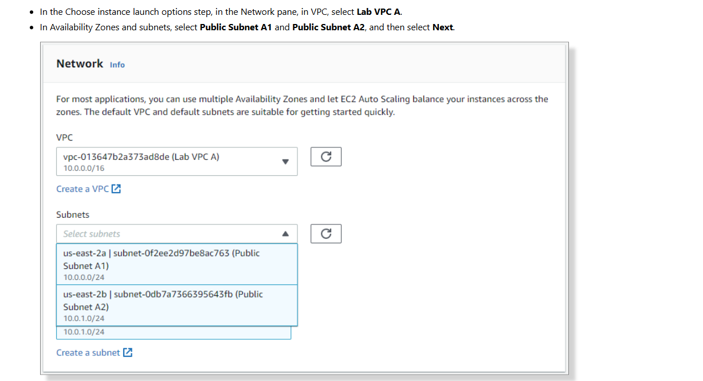
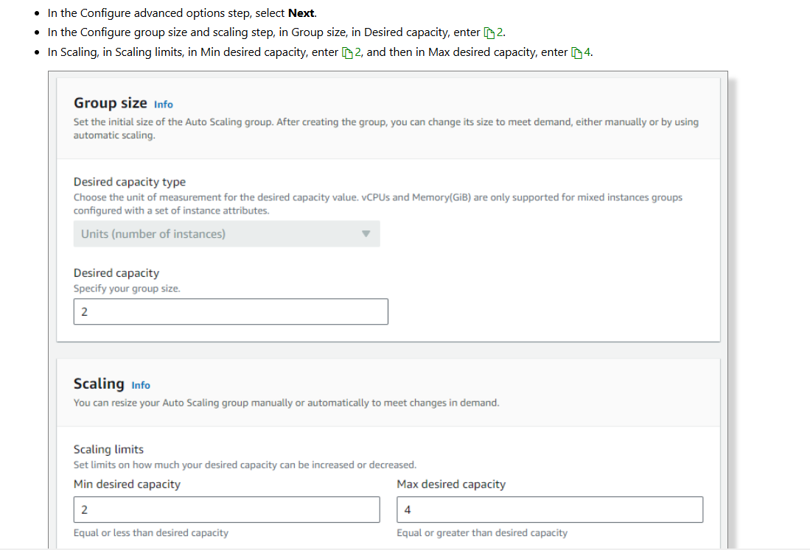
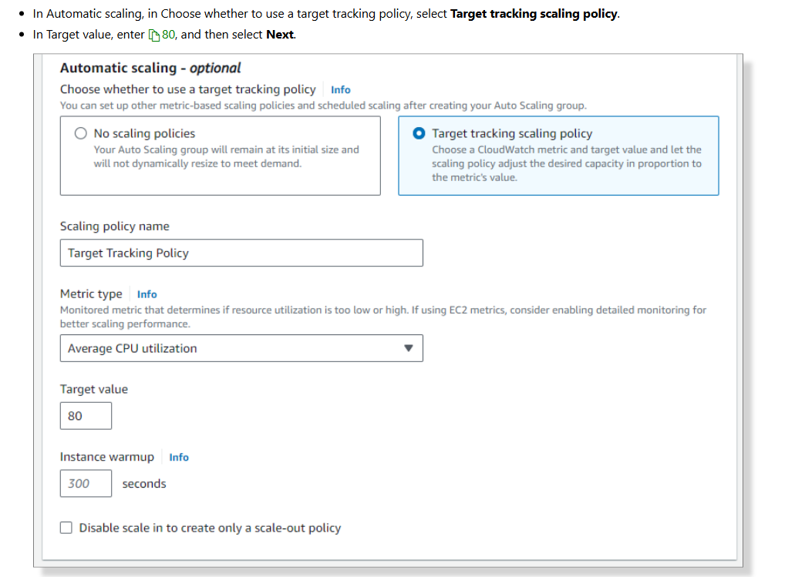

# Create EC2 instances by using auto scaling

# Scenario

In this challenge, you will configure and deploy Elastic Compute Cloud (EC2) instances by using an Auto Scaling group.

First, you will create a security group for a launch template, and then you will configure a launch template.

Next, you will create an Auto Scaling group.

Finally, you will test the Auto Scaling group.

# Step by step

## Create security group




## Create a launch template


```
#!/bin/bash
yum update -y
sudo amazon-linux-extras install epel -y
sudo yum install stress -y
amazon-linux-extras install -y lamp-mariadb10.2-php7.2 php7.2
yum install -y httpd
systemctl start httpd
systemctl enable httpd
usermod -a -G apache ec2-user
chown -R ec2-user:apache /var/www
chmod 2775 /var/www
find /var/www -type d -exec chmod 2775 {} \;
find /var/www -type f -exec chmod 0664 {} \;
echo '<center><h1>Welcome to Server: <?php echo $_SERVER["SERVER_ADDR"]; ?></h1><br><br></center>' > /var/www/html/index.php
```





## Create ASG - Auto Scaling Group










## Outcome


# Summary

Created a security group.

Configured a launch template.

Created a target group.

Tested the Auto Scaling group.
