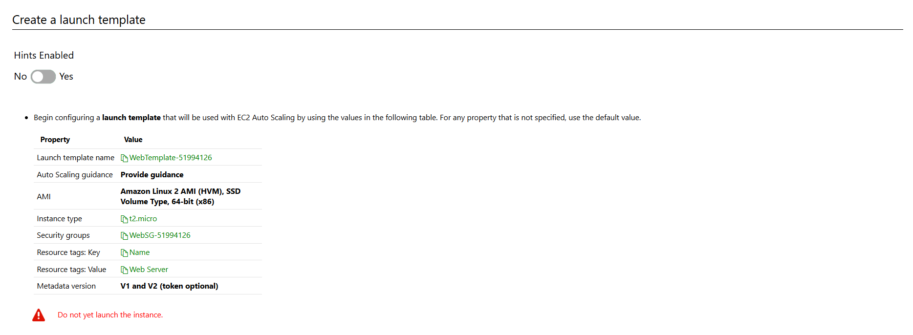
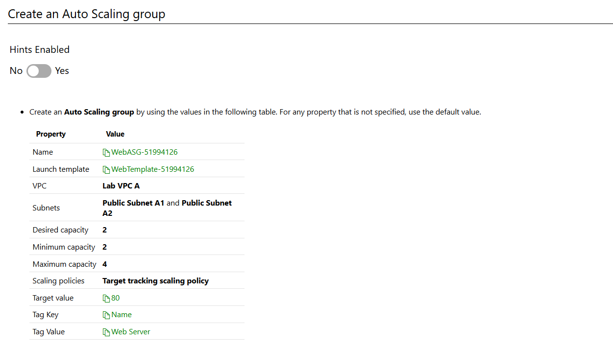

# Understand

Lab
45m45minutes
Skillsoft
English
Intermediate
Amazon Web Services

Before you start :
You have five attempts to complete each Challenge Lab.
Be sure to allow enough time to complete each Challenge Lab without interruption. Once you begin a Lab, you cannot save or pause it.
Challenge labs are meant to challenge you! We encourage you to learn by doing, and by discovery.
In this challenge, you will configure and deploy Elastic Compute Cloud (EC2) instances by using an Auto Scaling group. First, you will create a security group for a launch template, and then you will configure a launch template. Next, you will create an Auto Scaling group. Finally, you will test the Auto Scaling group. Note: Once you begin the challenge, you will not be able to pause, save, or exit and then return to your challenge. Please ensure that you have set aside enough time to complete the challenge before you start.

# Understand scenario

Understand the scenario
You are an Administrator with Hexelo, an organization that needs to manage an Amazon Web Services (AWS) environment.

In this Challenge Lab, you will configure and deploy Elastic Compute Cloud (EC2) instances by using an Auto Scaling group. First, you will create a security group for a launch template, and then you will configure a launch template. Next, you will create an Auto Scaling group. Finally, you will test the Auto Scaling group.

# Create security group

# Create a launch template

# Create ASG - auto scaling group

## outcome

# summary

Created a security group.
Configured a launch template.
Created an Auto Scaling group.
Tested the Auto Scaling group.
