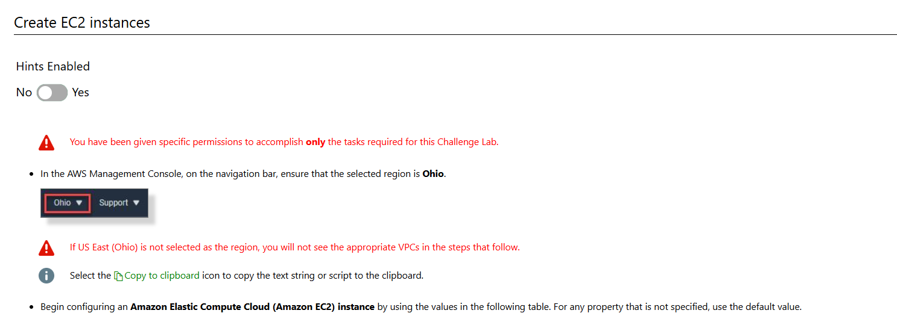
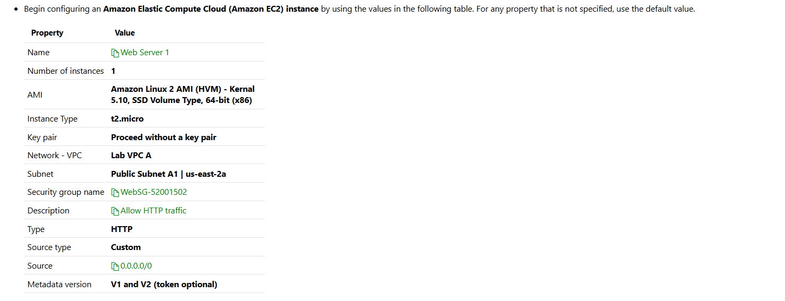
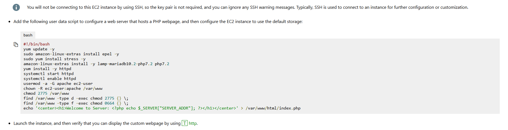
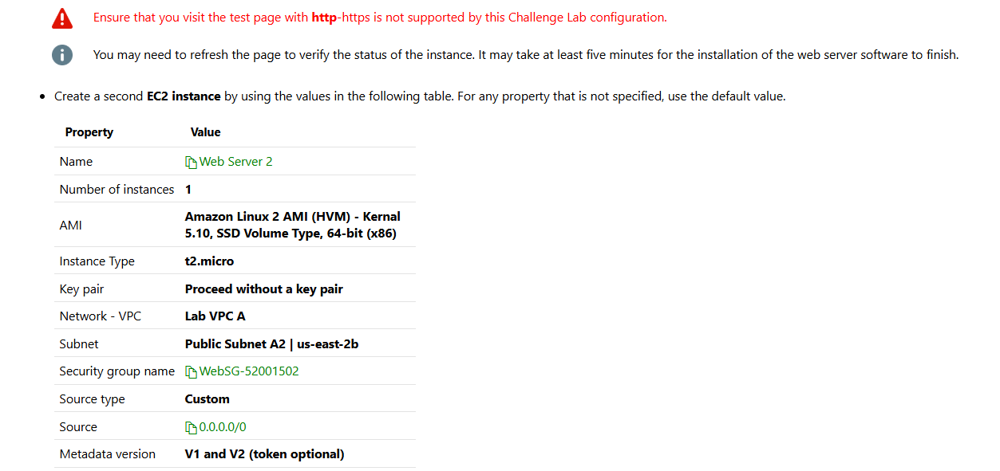
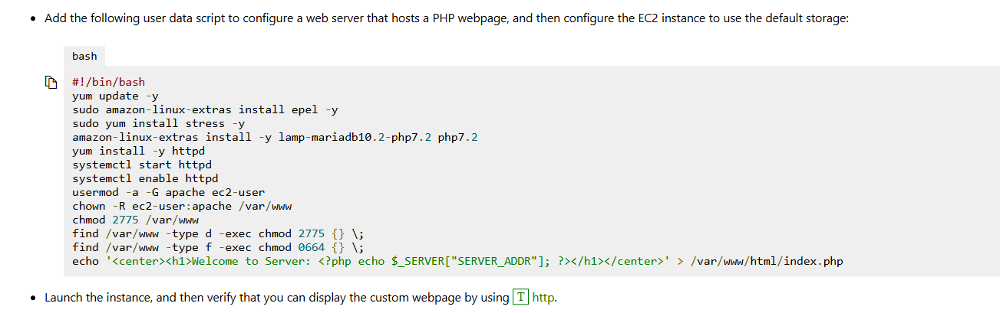
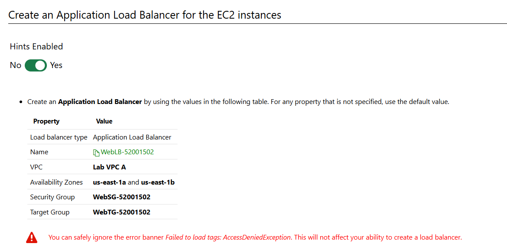

# Understand problem

In this challenge, you will configure Elastic Load Balancing for two Amazon Elastic Compute Cloud (Amazon EC2) instances. First, you will configure two EC2 instances as web servers. Next, you will create a target group that includes the EC2 instances. Finally, you will create a load balancer for the EC2 instances.

You are an Administrator for Hexelo, an organization that needs to manage an Amazon Web Services (AWS) environment.

In this Challenge Lab, you will configure Elastic Load Balancing for two Amazon Elastic Compute Cloud (Amazon EC2) instances. First, you will configure two EC2 instances as web servers. Next, you will create a target group that includes the EC2 instances. Finally, you will create a load balancer for the EC2 instances.

# Create EC2 instances







```
#!/bin/bash
yum update -y
sudo amazon-linux-extras install epel -y
sudo yum install stress -y
amazon-linux-extras install -y lamp-mariadb10.2-php7.2 php7.2
yum install -y httpd
systemctl start httpd
systemctl enable httpd
usermod -a -G apache ec2-user
chown -R ec2-user:apache /var/www
chmod 2775 /var/www
find /var/www -type d -exec chmod 2775 {} \;
find /var/www -type f -exec chmod 0664 {} \;
echo '<center><h1>Welcome to Server: <?php echo $_SERVER["SERVER_ADDR"]; ?></h1></center>' > /var/www/html/index.php
```

# create targte group


# Create an ALB for ec2 instances



# clean up resource

```

```
