# Understand problem

In this challenge, you will implement scaling for an Amazon Relational Database Service (RDS) instance. First, you will create security groups, and then you will deploy a MySQL DB instance. Next, you will create an Amazon Elastic Cloud Compute (Amazon EC2) instance to act as a server, and then you will add data to the database. Finally, you will scale the RDS instance vertically and horizontally, and then you will verify that you can access the data.

# Scenario

In this Challenge Lab, you will implement scaling for an Amazon Relational Database Service (RDS) instance. First, you will create security groups, and then you will deploy a MySQL DB instance. Next, you will create an Amazon Elastic Cloud Compute (EC2) instance to act as a server, and then you will add data to the database. Finally, you will scale the RDS instance vertically and horizontally, and then you will verify that you can access the data.

# Steps

# Create security group

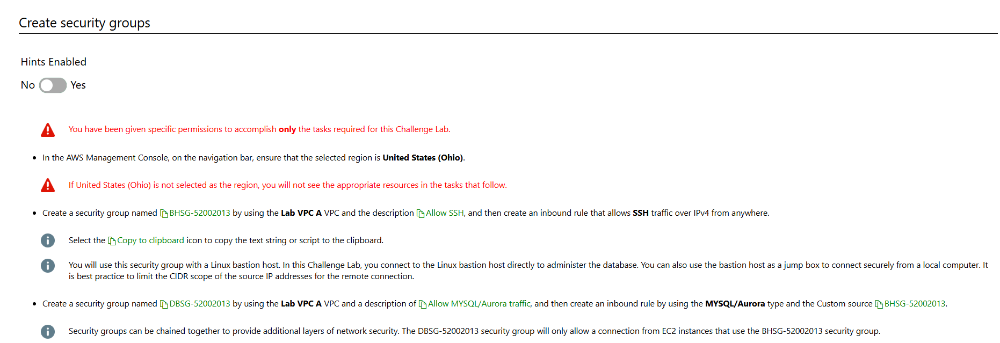
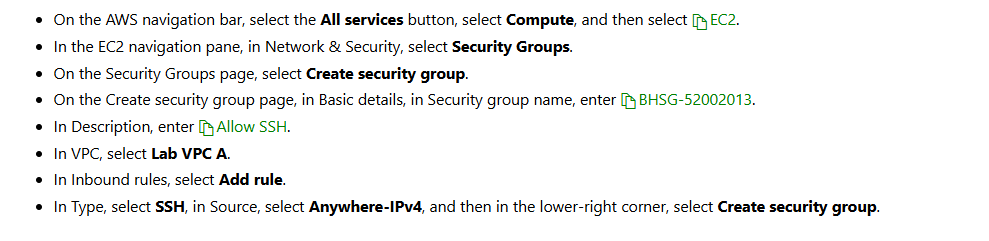
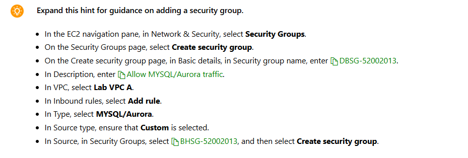

# Create db subnet group

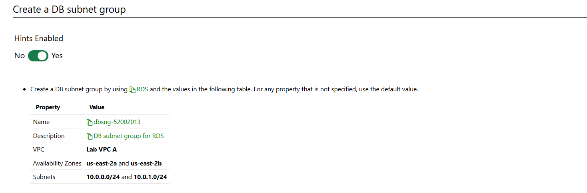
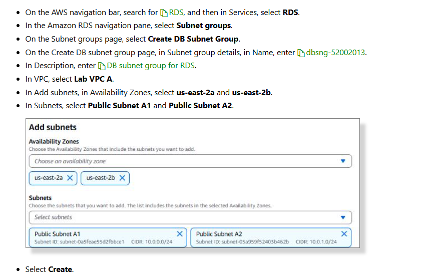
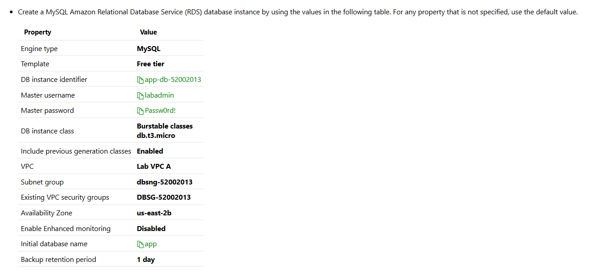

# Lauch bastion host ec2

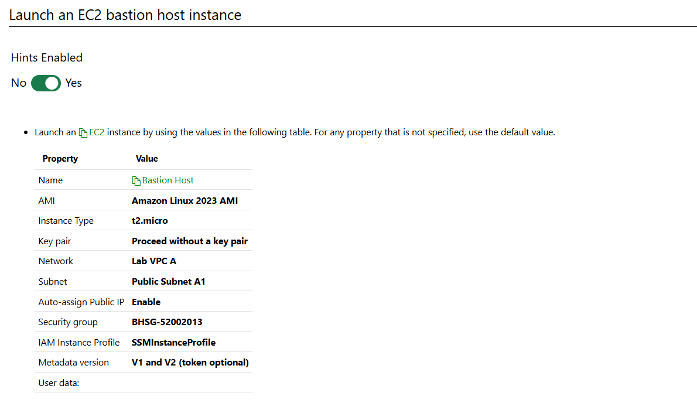

```
#!/bin/bash
yum update -y
sudo yum install stress -y
sudo yum install -y php php-common php-pear
sudo yum install -y php-{cgi,curl,mbstring,gd,mysqlnd,gettext,json,xml,fpm,intl,zip}
sudo yum install -y mariadb105
```

# Configure database instance

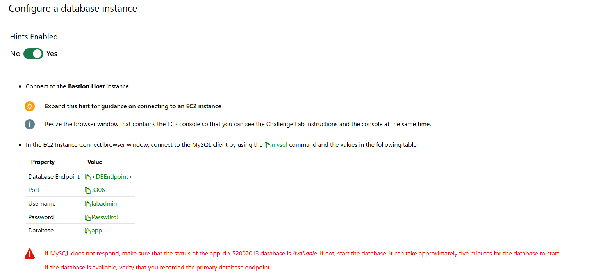

```
mysql -h <db-url> -P 3306 -u labadmin -p app
mysql -h app-db-52002644.cjk8km0mcns5.us-east-2.rds.amazonaws.com -P 3306 -u labadmin -p app
mysql -h app-db-2-52002644.cjk8km0mcns5.us-east-2.rds.amazonaws.com -P 3306 -u labadmin -p app
```

Passw0rd!

```
SHOW DATABASES;
```

```
CREATE TABLE subscribers
(
  id              INT unsigned NOT NULL AUTO_INCREMENT, # Unique ID for the record
  name            VARCHAR(150) NOT NULL,                # Name of the subscriber
  benefactor      VARCHAR(150) NOT NULL,                # Benefactor of the subscriber
  startdate       DATE NOT NULL,                        # Start date of the subscriber
  PRIMARY KEY     (id)                                  # Make the id the primary key
);
```

```
INSERT INTO subscribers ( name, benefactor, startdate) VALUES
 ( 'Sally', 'Harry', '2021-02-04' ),
 ( 'Tiger', 'Missy', '2020-12-14' ),
 ( 'Goldie', 'Pat', '2018-06-22' );
```

# Verticall scale

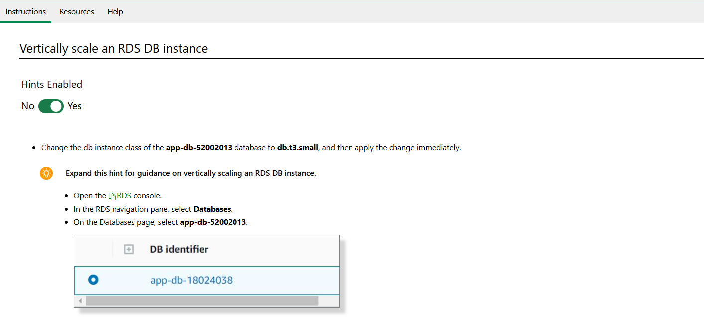
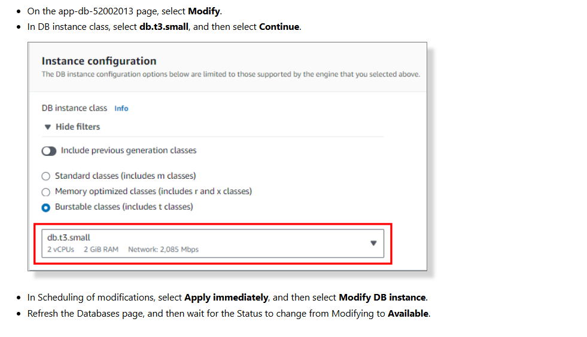

# Horizontal

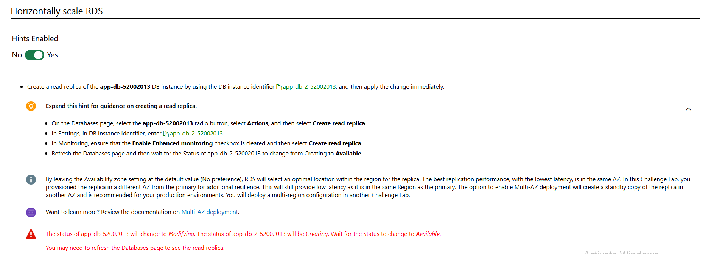
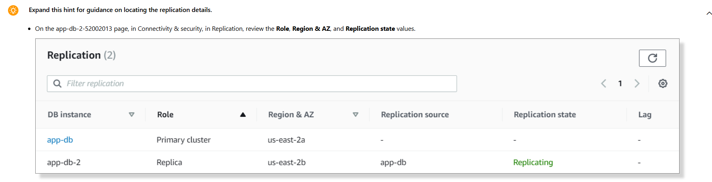

# Validate data access

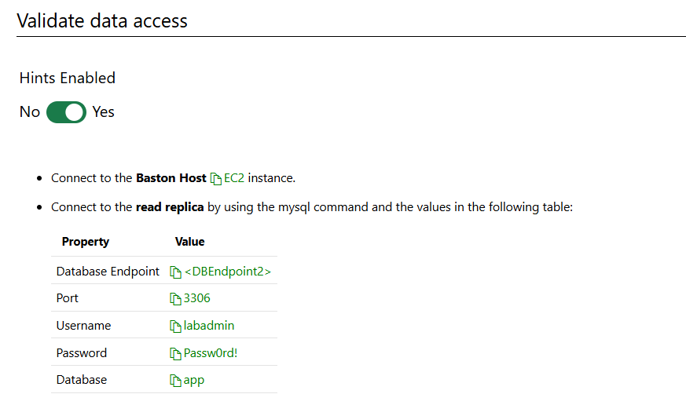

```
mysql -h <DBEndpoint2> -P 3306 -u labadmin -p app
```

```
STATUS
```

```
SHOW DATABASES;
```

```
SELECT * FROM subscribers;
```

# Question

1. Khi scale theo chiều dọc thì nó tằng gì gì lên, engine, ram, storage hay cái gì khác?
2. Khi scale theo chiều ngang thì cái nào là primary, cái nào là standby? cấu hình như thế nào? có ảnh hưởng gì đến người dùng hiện tại không?

# Summary

Created security groups.
Created a DB subnet group.
Created a MySQL DB instance in RDS.
Launched an EC2 bastion host instance.
Configured a database instance.
Vertically scaled an RDS DB instance.
Horizontally scaled RDS.
Validated data access.
