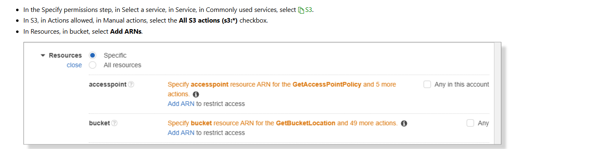
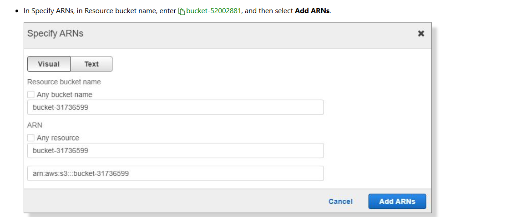

# Implement security by using an iam role

# Understanding problem

In this challenge, you will create create an Identity and Access Management (IAM) role that you will use to access an Amazon Simple Storage Service (Amazon S3) bucket from an Elastic Compute Cloud (EC2) instance. First, you will create an Amazon S3 bucket to store objects, and then you will create a role to provide access to the bucket from an EC2 instance. Next, you will create an IAM policy that provides full control of the bucket, and then you will assign the policy to the role. Finally, you will create a new EC2 instance that will use the role, and then you will sign in to the EC2 instance and test the role.

# Steps

In this Challenge Lab, you will create an Identity and Access Management (IAM) role that you will use to access an Amazon Simple Storage Service (Amazon S3) bucket from an Elastic Compute Cloud (EC2) instance. First, you will create an Amazon S3 bucket to store objects, and then you will create a role to provide access to the bucket from an EC2 instance. Next, you will create an IAM policy that provides full control of the bucket, and then you will assign the policy to the role. Finally, you will create a new EC2 instance that will use the role, and then you will sign in to the EC2 instance and test the role.

## Create an s3 bucket


## Create a policy







Note: S3 policy

```
{
    "Version": "2012-10-17",
    "Statement": [
        {
            "Sid": "Statement1",
            "Effect": "Allow",
            "Action": [
                "s3:*"
            ],
            "Resource": [
                "arn:aws:s3:::bucket-52003176",
                "arn:aws:s3:::bucket-52003176/*"
            ]
        }
    ]
}
```

## Create a role


# Question

khác nhau giữa `Set permissions boundary - optional` với `Permissions policies`

# Create instance


# Connect ec2 access S3


```
aws s3 ls bucket-52002881
```
