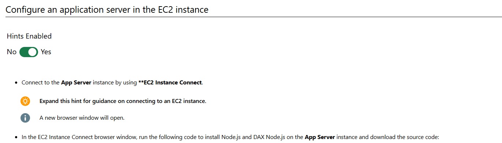

# 08 Implement caching in aws by using dax

In this challenge, you will implement caching for an application. First, you will deploy an Amazon DynamoDB Accelerator (DAX) cluster, and then you will configure an Identity and Access Management (IAM) role by using a policy. Next, you will launch an Amazon Elastic Cloud Compute (Amazon EC2) instance for your application, and then you will configure the EC2 instance. Finally, you will run the application, and then you will review the response times for the DAX cluster.

# Understand scenario

In this Challenge Lab, you will implement caching for an application. First, you will deploy an Amazon DynamoDB Accelerator (DAX) cluster, and then you will configure an Identity and Access Management (IAM) role by using a policy. Next, you will launch an Amazon Elastic Cloud Compute (Amazon EC2) instance for your application, and then you will configure the EC2 instance. Finally, you will run the application, and then you will review the response times for the DAX cluster.

# Steps


# Verify iam role exist appropriate IAM policy


```
{
"Version": "2012-10-17",
"Statement": [
    {
        "Action": [
            "dynamodb:*",
            "dax:*"
        ],
        "Resource": "*",
        "Effect": "Allow"
    }
]
}
```

## Deploy ec2 as app server


# Configure ec2



```
sudo yum update -y
#Install node version manager (nvm) by using AWS CLI.
curl -o- https://raw.githubusercontent.com/nvm-sh/nvm/v0.35.3/install.sh | bash
export NVM_DIR="$HOME/.nvm"
\. "$NVM_DIR/nvm.sh"
#Install Node.js using nvm.
nvm install 12.16.3
#Install DAX Node.js client using nvm.
npm install amazon-dax-client
#Download compressed source code.
wget http://docs.aws.amazon.com/amazondynamodb/latest/developerguide/samples/TryDax.zip
#Unzip compressed source code and change directory.
unzip TryDax.zip
```


## Testing caching dax


```
node 01-create-table.js

node 02-write-data.js

node 03-getitem-test.js

node 04-query-test.js

node 05-scan-test.js

node 03-getitem-test.js dax://daxcluster-52003325.g4frua.dax-clusters.us-east-2.amazonaws.com

node 04-query-test.js dax://daxcluster-52003325.g4frua.dax-clusters.us-east-2.amazonaws.com

node 05-scan-test.js dax://daxcluster-52003325.g4frua.dax-clusters.us-east-2.amazonaws.com

```

# Summary

Congratulations, you have completed the Implement Caching in AWS by Using DAX Challenge Lab.

You have accomplished the following:

Deployed a DAX cluster.

Configured secure access.

Launched an EC2 instance.

Configured an application server.

Ran an application by using a DAX connection.

Ran an application by using a DynamoDB connection.

Compared the response time of DynamoDB and DAX connections.
