Create an ec2 instance by using a launch template

# Scenario

You are a systems architect. You need to create a template that you can use to create Amazon Web Services (AWS) EC2 instances. The template must support version control.

First, you will create a key pair, and then you will create a security group.

Next, you will create a launch template, and then you will use the launch template to create an EC2 instance.

Finally, you will create a new version of the template that will install an Apache web server, and then you will create a new EC2 instance that contains an Apache web server.

# Steps

# Create a key pair

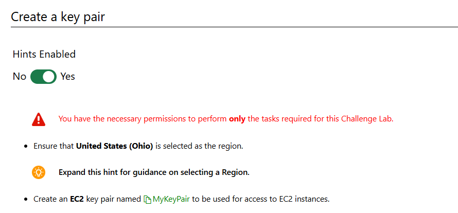

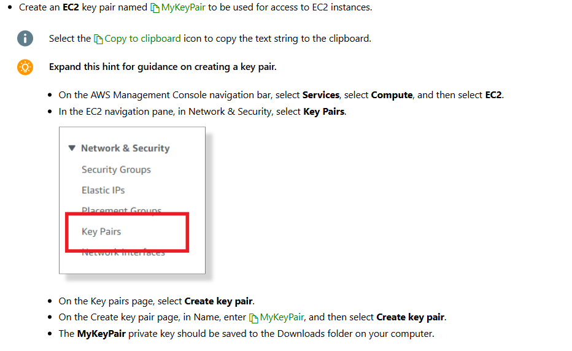

# Create security group

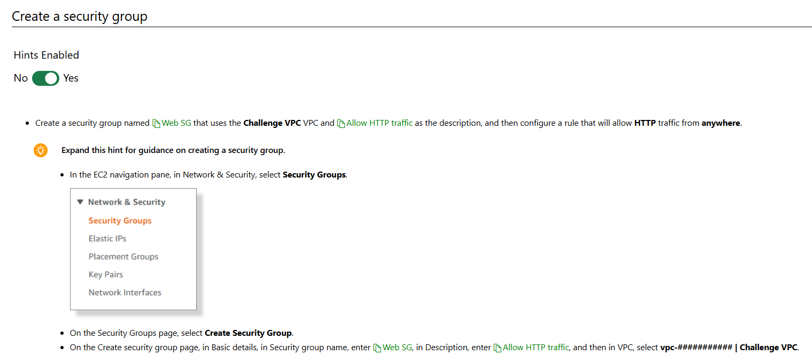

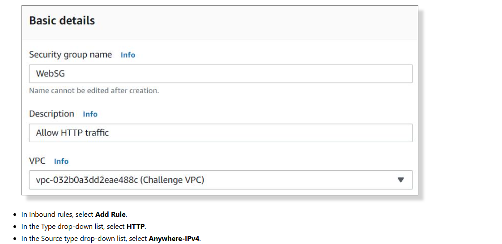

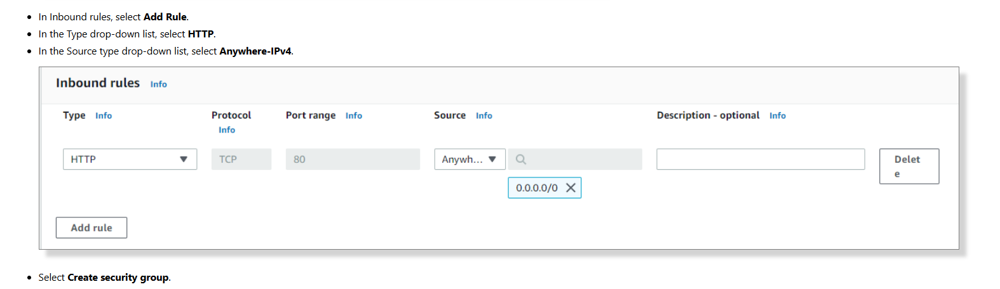

# Launch a template

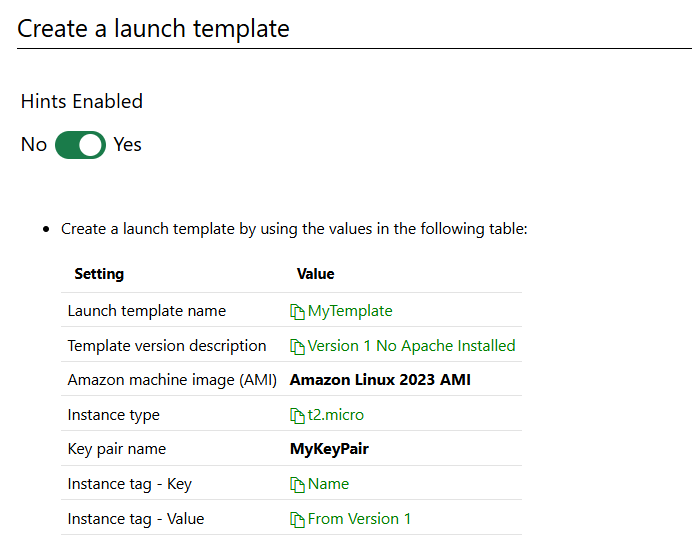

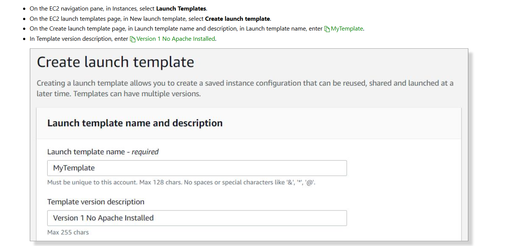

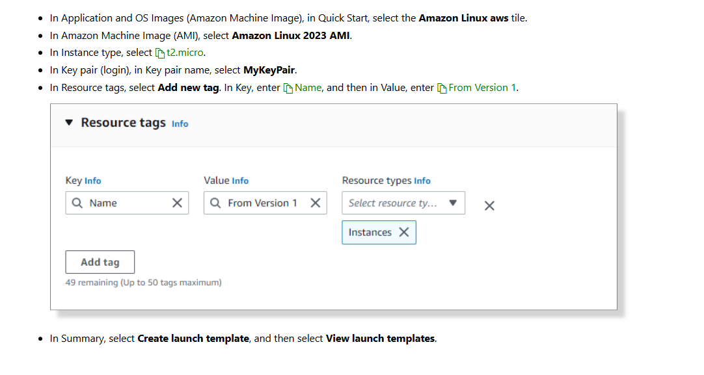

# Create an instance

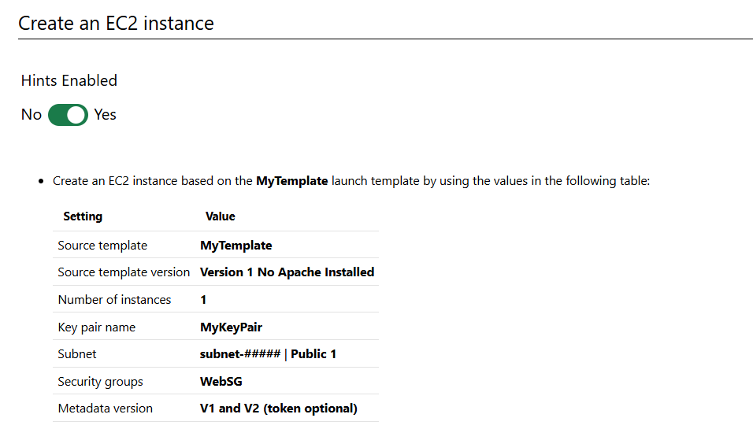

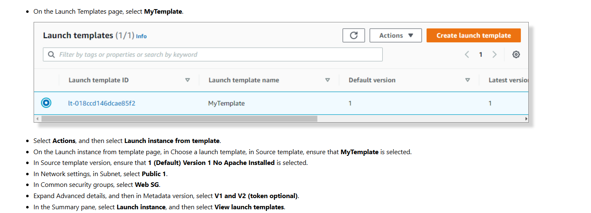

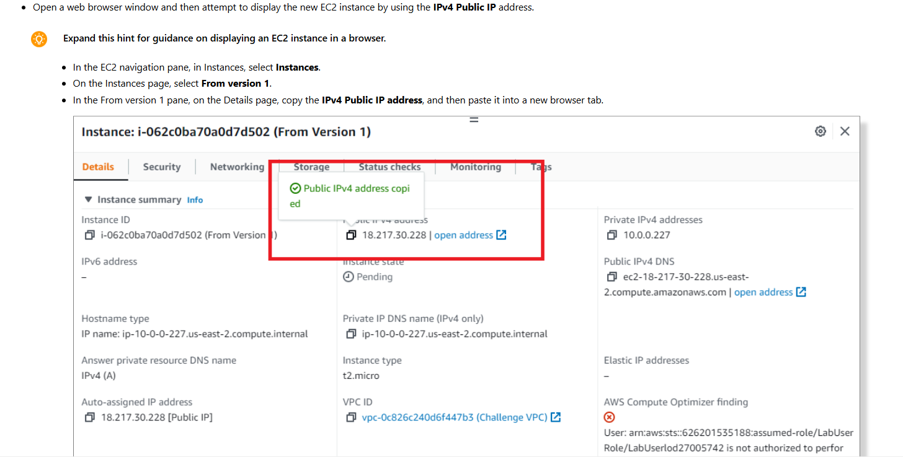

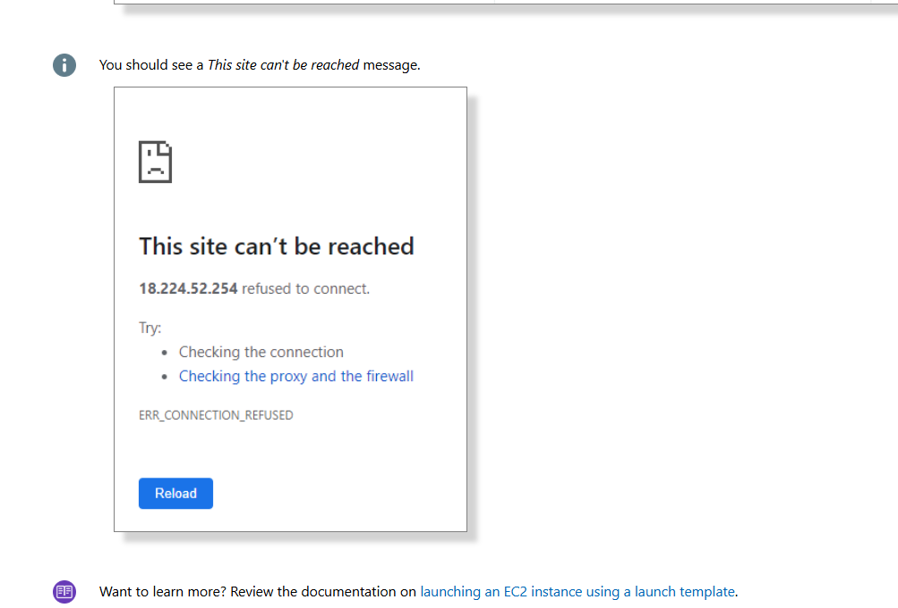

# Modify the template

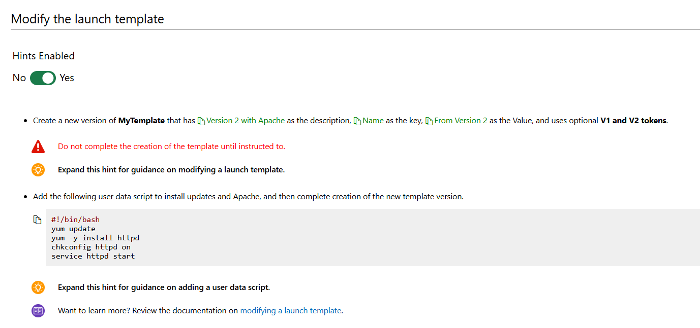

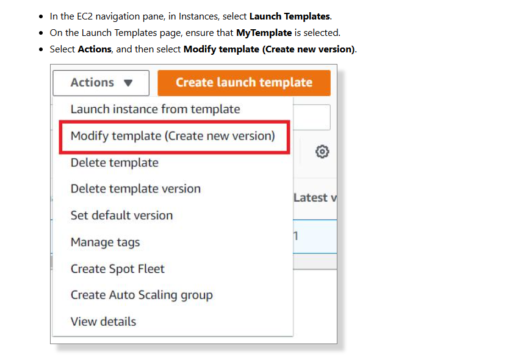

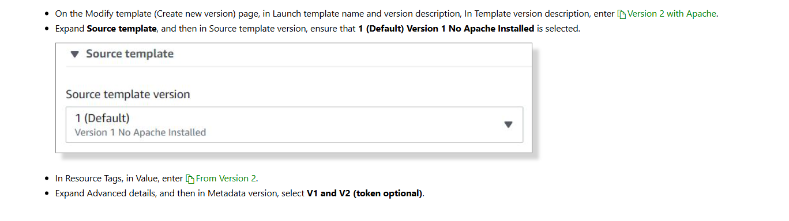

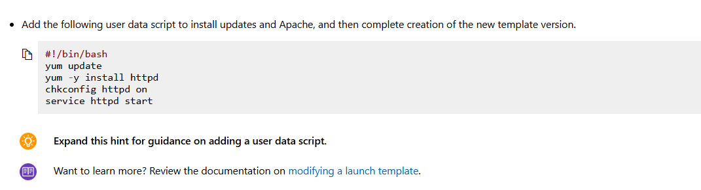

```
#!/bin/bash
yum update
yum -y install httpd
chkconfig httpd on
service httpd start
```

# Create new instance with the new launch template

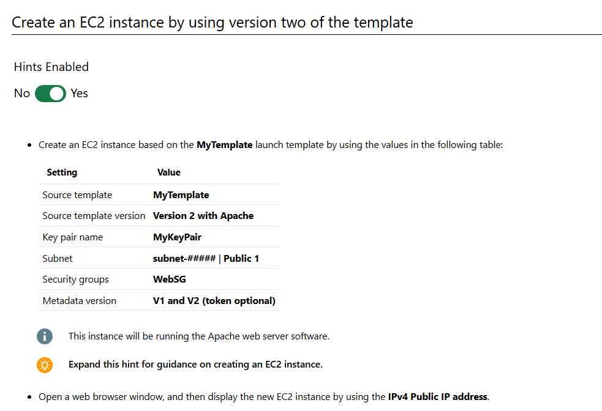

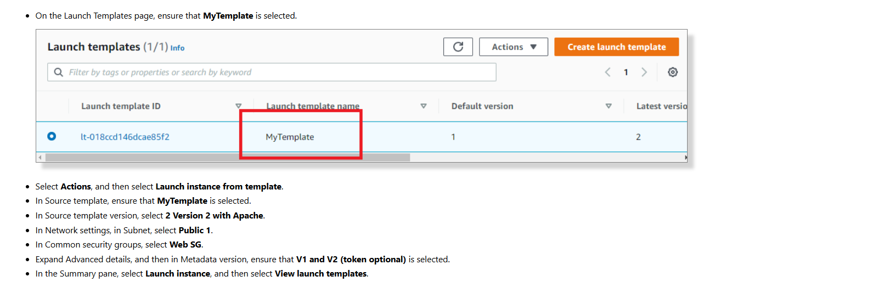

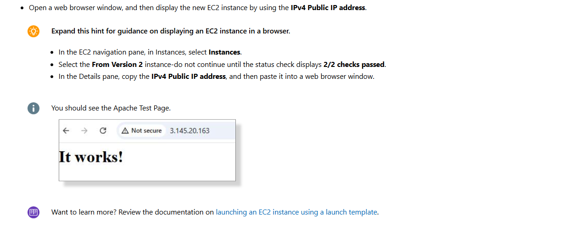

# Summary

Created a key pair to use when launching instances.

Created a security group to allow HTTP traffic.

Created a launch template.

Created an EC2 instance by using the launch template.

Created a second version of the launch template that installs the Apache web server.

Created an EC2 instance by using version 2 of the launch template.
