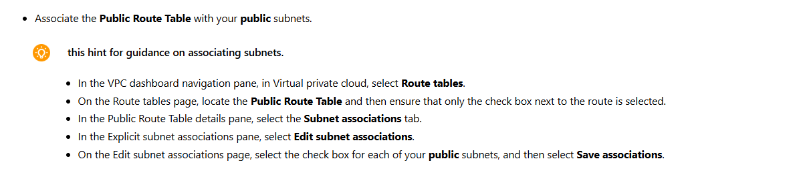

Build VPC Resources Manually

# Scenario

In this challenge, you will create a custom VPC with public and private subnets, and an Internet and NAT Gateway. You will then associate route tables with the correct subnets.

# steps

# Create a new vpc

# Create public subnets

# Create private subnets

# Create an internet gateway

# Create a NAT gateway

# Configure route table

## Create a new route table named Public Route Table for Lab VPC.

# Summary

Congratulations, you have completed the Build VPC Resources Manually Challenge Lab.

You have accomplished the following:

Created a custom VPC that has public and private subnets, an internet gateway, and a NAT gateway.
Created and associated route tables with subnets.
