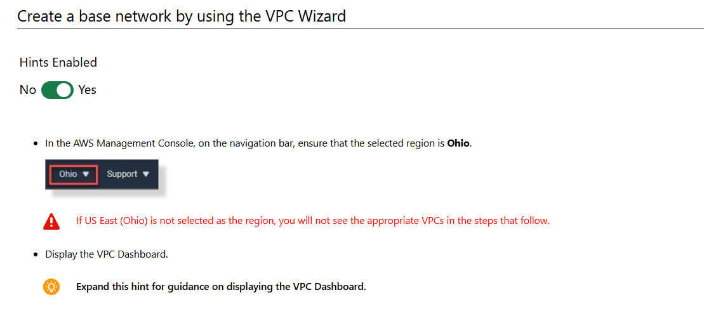
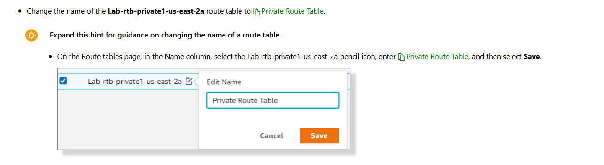

Build a Network by Using the VPC Wizard

# Scenario

In this challenge, you will create a custom VPC with public and private subnets, and an Internet and NAT Gateway. You will then associate route tables with the correct subnets.

# Steps

## Create additional subnets

## Configure route table

Verify that the Lab-rtb-private1-us-east-2a route table for the Lab VPC has a route to your NAT gateway.

Change the name of the Lab-rtb-private1-us-east-2a route table to `Private Route Table`

# Summary

Congratulations, you have completed the Build a Network by Using the VPC Wizard Challenge Lab.

You have accomplished the following:

Created a custom VPC that has public and private subnets, an internet gateway, and a NAT gateway.

Created two additional subnets.

Associated route tables with subnets.
