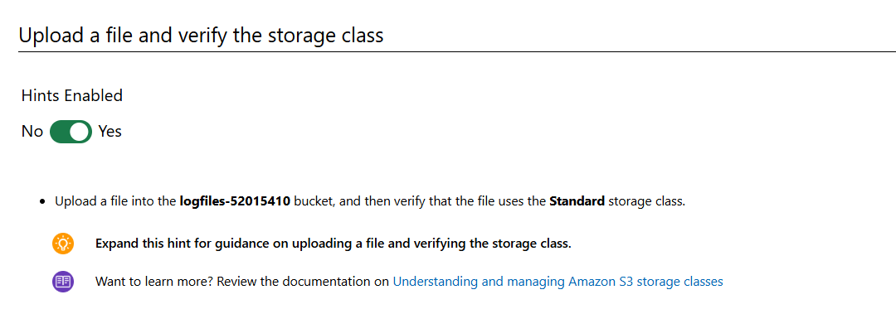
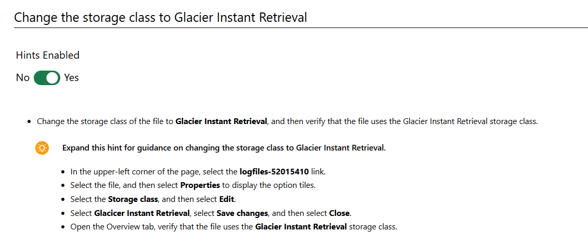

Create an Object Lifecycle Policy for Amazon S3 Documents

# Scenario

In this challenge, you will change the storage class on files manually. Then you will setup a lifecycle policy to automatically maintain log files. The files will first be moved into S3 IA after 30 days, then to Glacier after 60 days, then deleted after one year.

# Steps

## Create a s3 bucket

## Update a file

## Change the storage class to standard IA

## Change the storage class to Glacier Instant Retrieval

## Manual deleting the file

## Configure lifecycle rule

## Review

# Summary

Congratulations, you have completed the Create an Object Lifecycle Policy for Amazon S3 Documents Challenge Lab.

You have accomplished the following:

Created a new S3 bucket for log files.

Created an S3 lifecycle rule to move files to the Standard-IA storage class after 30 days, move them to the Glacier

storage class after 60 days, and permanently delete them after 365 days.
