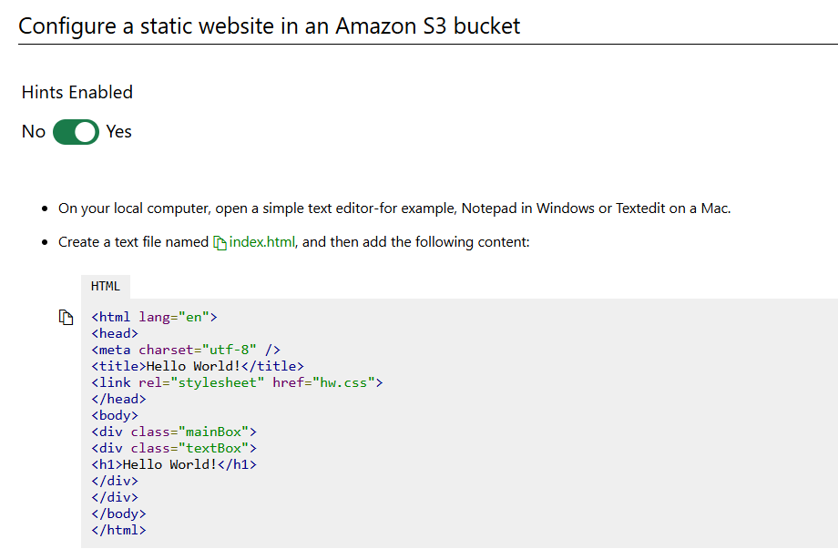
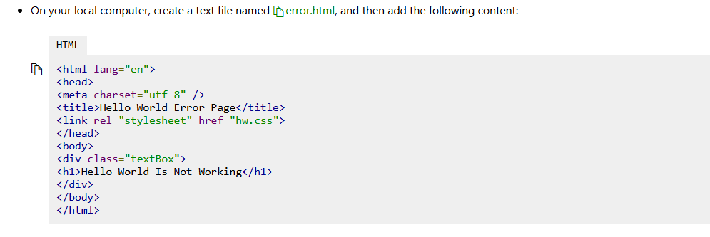

# Can You Build a Website by Using an Amazon S3 Bucket?

# Scenario

In this challenge, you will create a static website by using an Amazon Simple Storage Service (Amazon S3) bucket. First, you will create an Amazon S3 bucket, and then you will configure version control for the bucket. Next, you will create a static website, and then you will configure public access for the bucket. Finally, you will enable transfer acceleration for the bucket, and then you will create a lifecycle rule that will archive old content automatically.

# Steps

# Create buckets


# Configure a static website


`index.html`

```
<html lang="en">
<head>
<meta charset="utf-8" />
<title>Hello World!</title>
<link rel="stylesheet" href="hw.css">
</head>
<body>
<div class="mainBox">
<div class="textBox">
<h1>Hello World!</h1>
</div>
</div>
</body>
</html>
```

`error.html`

```
<html lang="en">
<head>
<meta charset="utf-8" />
<title>Hello World Error Page</title>
<link rel="stylesheet" href="hw.css">
</head>
<body>
<div class="textBox">
<h1>Hello World Is Not Working</h1>
</div>
</body>
</html>
```

`hw.css`

```
body {
background-color: #36a;
}
.mainBox {
width: 100%;
display: flex;
flex-direction: column;
align-items: center;
}
.textBox {
width: 30%;
text-align: center;
}
h1 {
color: #fff;
}
img {
width: 50%;
border: 1px solid #fff;
}
```







# Configure data management for an S3 bucket


# Summary

Congratulations, you have completed the Can You Build a Website by Using an Amazon S3 Bucket? Challenge Lab.

You have accomplished the following:

Created a Amazon S3 bucket.

Configured an Amazon S3 bucket as a static website.

Configured version control for an Amazon S3 bucket.

Configured public access to an Amazon S3 bucket.

Enabled transfer acceleration for an Amazon S3 bucket.

Configured a lifecycle rule that will archive old content after 60 days.
