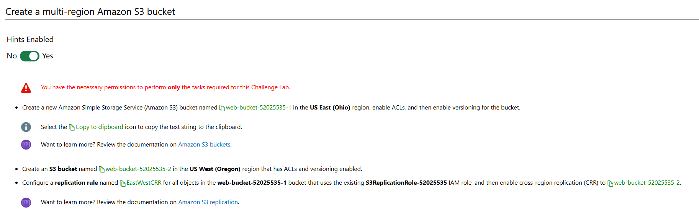
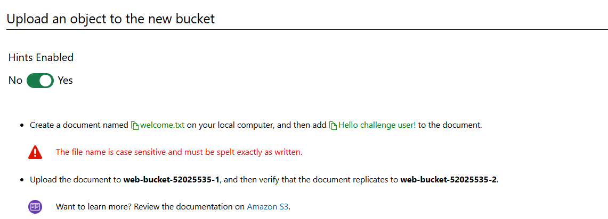
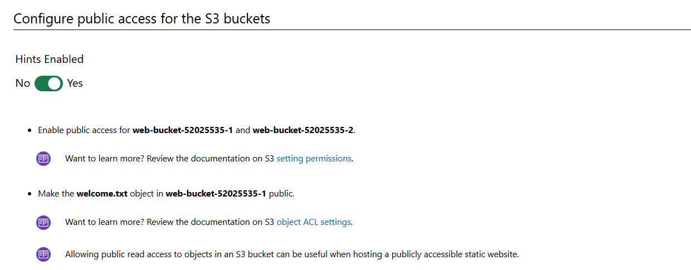
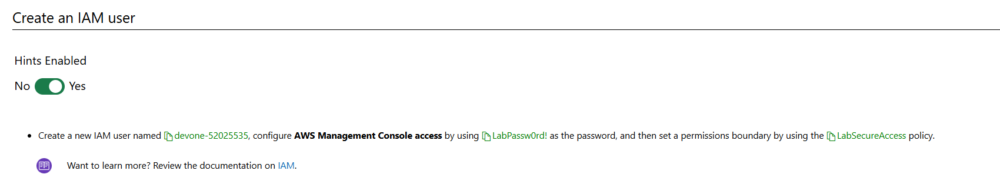
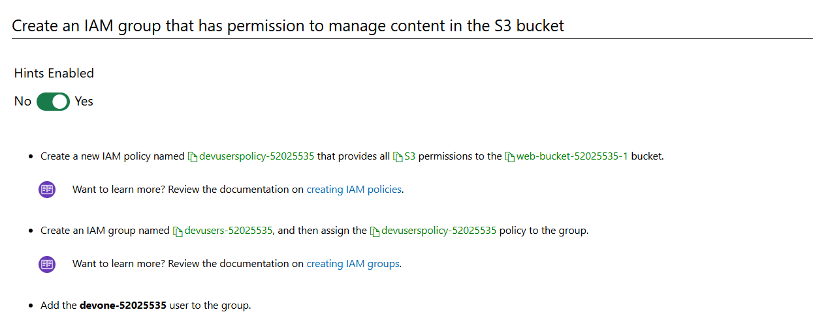

# Can You Secure Access to an S3 Bucket

In this Challenge Lab, you will configure a multi-region Amazon Simple Storage Service (Amazon S3) bucket that will store static assets for a website, that is publicly accessible for read operations, and that allows write access for a group of web administrators. First, you will create an Amazon S3 bucket to store the assets, and then you will configure cross-region replication (CRR) to a new bucket. Next, you will enable public access to the bucket, and then you will create a user account for the web administrator. Next, you will create an Identity and Access Management (IAM) policy that provides full control of the bucket, and then you will create a new group. Finally, you will assign the IAM policy to the group, and then you will add the web administrator to the group.

# Steps

Create a new Amazon Simple Storage Service (Amazon S3) bucket named `web-bucket-52025535-1` in the US `East (Ohio)` region, enable ACLs, and then enable versioning for the bucket.

Create an S3 bucket named `web-bucket-52025535-2` in the US West (Oregon) region that has ACLs and versioning enabled.

Configure a replication rule named `EastWestCRR` for all objects in the `web-bucket-52025535-1` bucket that uses the existing `S3ReplicationRole-52025535` IAM role, and then enable cross-region replication (CRR) to `web-bucket-52025535-2`.

# Create a multi-region Amazon S3 bucket

# Upload an object to the new bucket

# Configure public access for s3 bucket

# Create an IAM user

# Create an IAM Group

# Summary

Congratulations, you have completed the Can You Secure Access to an S3 Bucket? Challenge Lab.

You have accomplished the following:

Created a multi-region S3 bucket.

Uploaded an object to a bucket.

Enabled public access to a bucket and its objects.

Created an IAM user.

Created an IAM group that has permission to manage content in a bucket.

Added the IAM user to a gro
