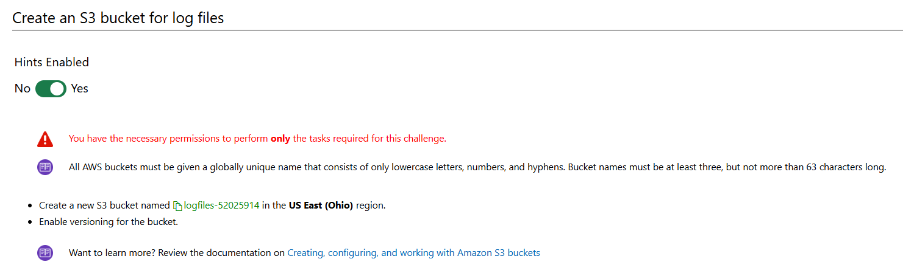
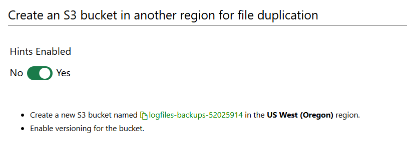
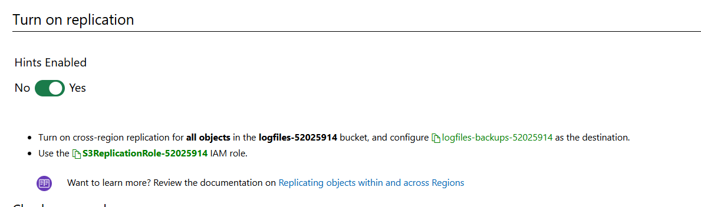
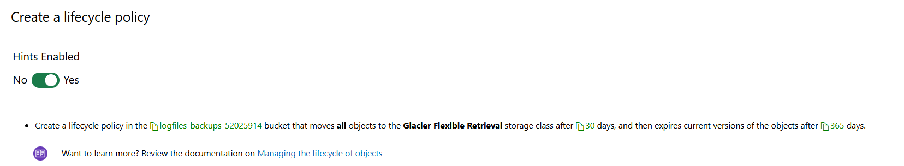

# Can You Enable Cross-Region Replication and Archiving?

In this challenge, you will create a bucket for logs files that replicates across regions into IA. You will then use a lifecycle policy in the new region to archive the files in Glacier after 30 days and deletes them after one year.

# Steps

# Create an S3 bucket for log files

# Create an S3 bucket in another region for file replication

logfiles-backups-52025914

# Turn on replication

# Create a lifecycle policy

# Summary

Congratulations, you have completed the Can You Enable Cross-Region Replication and Archiving? Challenge Lab.

You have accomplished the following:

Created a new S3 bucket for log files.

Created a new S3 bucket in a different region.

Enabled cross-region replication.

Created a lifecycle policy to archive files to the Glacier storage class.
