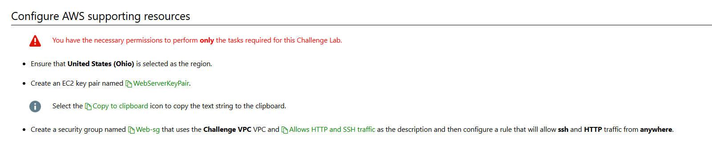
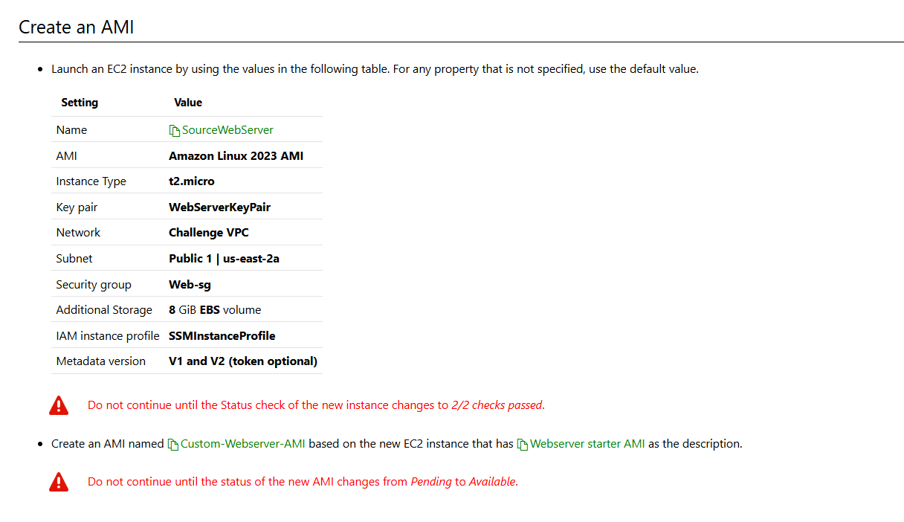
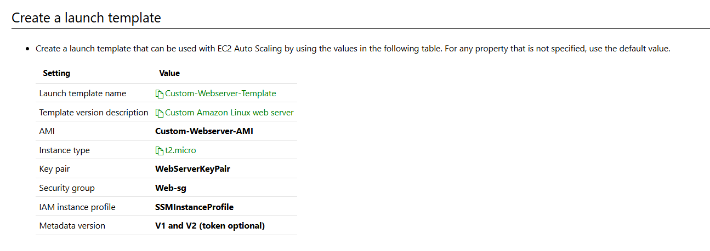
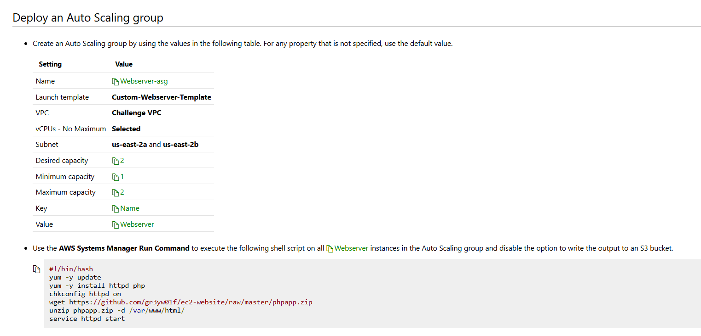
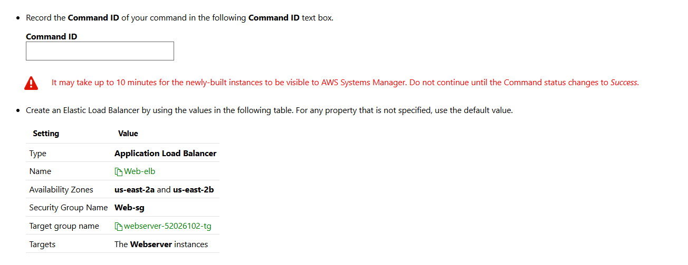

# Can You Configure a Resilient EC2 Server Farm

In this challenge, you will configure a web server farm that can scale to meet future demand. First, you will configure the supporting resources, and then you will create a custom Amazon Machine Image (AMI) based on an existing instance. Next, you will create a launch template, and then you will configure an Auto Scaling group. Finally, you will install a web server by using AWS System Manager Run Command, and then you will configure load balancing for the server farm.

# Steps

# Configure aws support resource



# Create an AMI



# Create a launch template



Create a launch template that can be used with EC2 Auto Scaling by using the values in the following table. For any property that is not specified, use the default value.

```
Setting	Value
Launch template name	Custom-Webserver-Template
Template version description	Custom Amazon Linux web server
AMI	Custom-Webserver-AMI
Instance type	t2.micro
Key pair	WebServerKeyPair
Security group	Web-sg
IAM instance profile	SSMInstanceProfile
Metadata version	V1 and V2 (token optional)

```

# Deploy an auto scaling group





# Summary

Congratulations, you have completed the Can You Configure a Resilient EC2 Server Farm? Challenge Lab.

You have accomplished the following:

Created an EC2 instance.
Created a custom AMI based on an existing instance.
Created a launch template
Installed a web server on the EC2 instances by using Systems Manager Run Command.
Created an elastic load balancer for web traffic.
Added the EC2 instances as targets for an Application Load Balancer.
