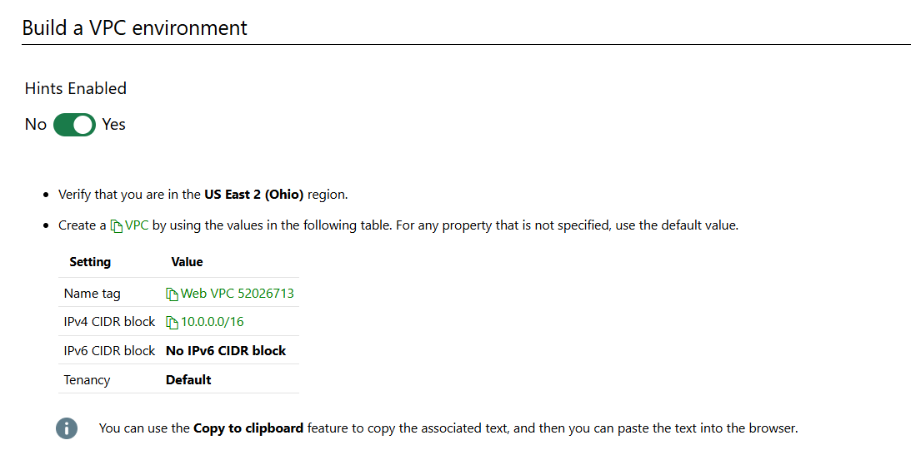
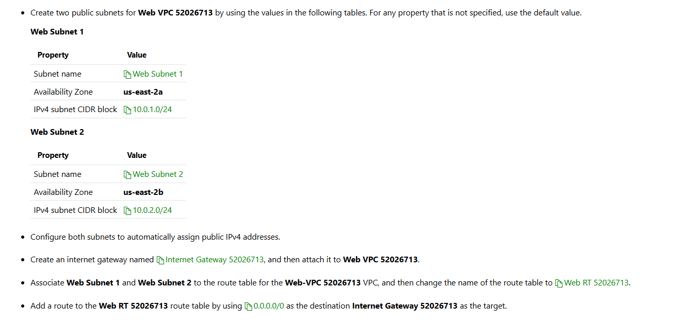
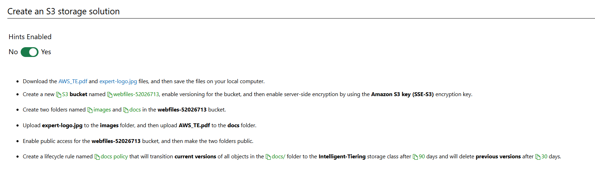
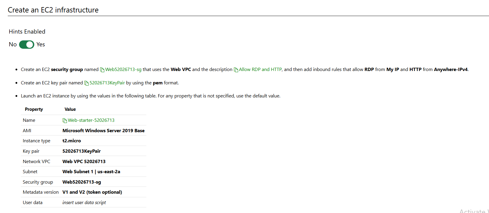
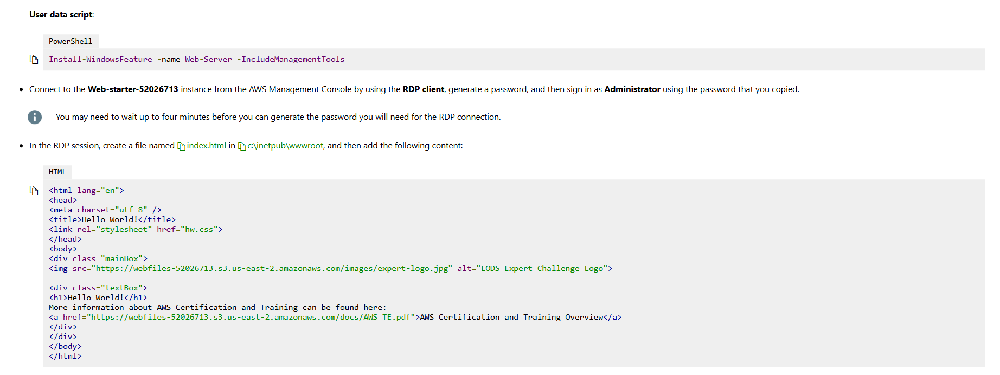
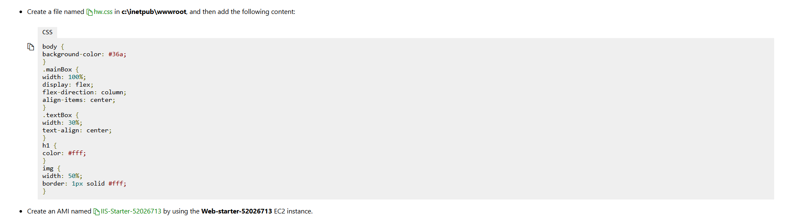
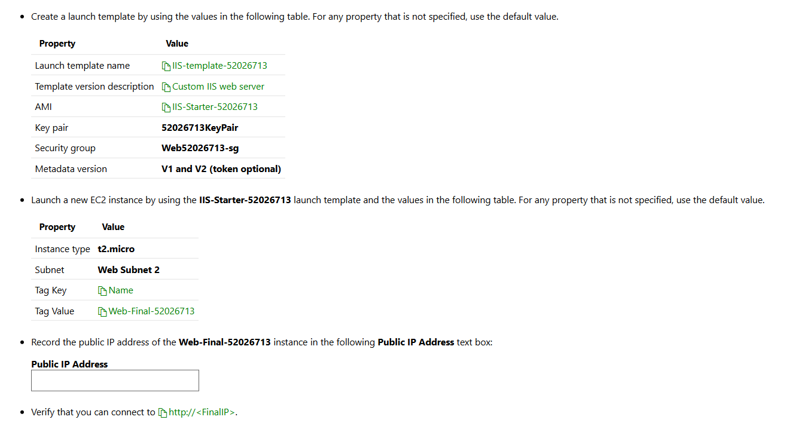

# Can You Deploy an End-to-End Solution in AWS

In this challenge, you will configure a repeatable environment for a publicly available website by using the Amazon Simple Storage Service (Amazon S3) and Elastic Compute Cloud (EC2) services.

First, you will create a Virtual Private Cloud (VPC) environment for the EC2 instances.

Next, you will create an Amazon S3 bucket that will hold the static web content for the website, and then you will create a custom EC2 launch template that includes the web server engine and an initial homepage for the website.

Finally, you will deploy a web server based on the custom launch template, and then you will verify that the website is publicly available from the new EC2 instance.

# Steps

# Build VPC





# Create an S3 storage solution



# Create an EC2 infrastructure









O2N(F7XBO9s!acfvt5PGhj?Z\*fZ%Z65)

```
<html lang="en">
<head>
<meta charset="utf-8" />
<title>Hello World!</title>
<link rel="stylesheet" href="hw.css">
</head>
<body>
<div class="mainBox">


<div class="textBox">
<h1>Hello World!</h1>
More information about AWS Certification and Training can be found here:
<a href="https://webfiles-52026713.s3.us-east-2.amazonaws.com/docs/AWS_TE.pdf">AWS Certification and Training Overview</a>
</div>
</div>
</body>
</html>
```

```
body {
background-color: #36a;
}
.mainBox {
width: 100%;
display: flex;
flex-direction: column;
align-items: center;
}
.textBox {
width: 30%;
text-align: center;
}
h1 {
color: #fff;
}
img {
width: 50%;
border: 1px solid #fff;
}
```

# Summary

Congratulations, you have completed the Can You Deploy an End-to-End Solution in AWS? Challenge Lab.

You have accomplished the following:

Created a VPC.
Created an internet gateway.
Configured a route table.
Created an S3 bucket and folders to hold web content.
Configured public access for the web content.
Created lifecycle rules for the web content.
Created an EC2 instance that contains the web server and custom content.
Created an AMI based on the custom EC2 instance.
Created a launch template based on the custom AMI.
Launched a new EC2 instance from the launch template.
